# 数据库实验一    用SQL进行数据操作

|  姓名  |   学号    |            邮箱            | 编辑时间  |
| :----: | :-------: | :------------------------: | :-------: |
| 刘国涛 | 181860055 | 181860055@smail.nju.edu.cn | 2020.11.2 |

## 实验环境

>|  操作系统  | Windows 10 20H2  |
>| :--------: | :--------------: |
>| 数据库版本 | mysql Ver 8.0.21 |
>| 代码编辑器 |      vscode      |


## 实验过程

### 使用SQL语句建立基本表

```mysql
CREATE TABLE IF NOT EXISTS `Course` (
  `id` INT NOT NULL PRIMARY KEY COMMENT '课程号',
  `title` CHAR(20) NOT NULL COMMENT '课程名',
  `dept_name` CHAR(20) DEFAULT NULL COMMENT '院系名',
  `credit` INT COMMENT '学分'
);
CREATE TABLE IF NOT EXISTS Student (
  id INT NOT NULL PRIMARY KEY COMMENT '学号',
  name CHAR(20) NOT NULL COMMENT '学生姓名',
  dept_name CHAR(20) COMMENT '院系名',
  major_name CHAR(20) COMMENT '专业名'
);
CREATE TABLE IF NOT EXISTS SC (
  student_id INT NOT NULL COMMENT '学号',
  course_id INT NOT NULL COMMENT '课程号',
  year INT COMMENT '选课年份',
  grade INT COMMENT '成绩',
  PRIMARY KEY(student_id,course_id)
);
CREATE TABLE IF NOT EXISTS Teacher (
  id INT NOT NULL PRIMARY KEY COMMENT '教师编号',
  name CHAR(20) NOT NULL COMMENT '教师姓名',
  dept_name CHAR(20) COMMENT '院系名',
  salary INT COMMENT '工资'
);
```

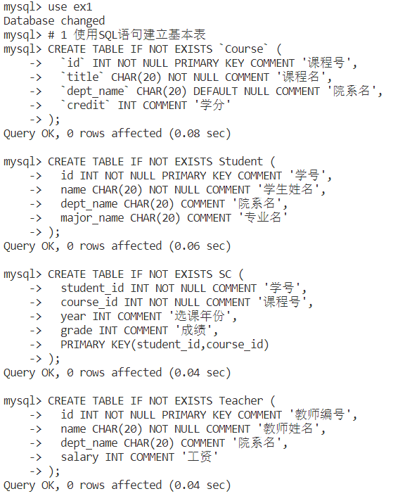

### 使用SQL语句修改基本表

```mysql
ALTER TABLE Student
ADD COLUMN age SMALLINT;
ALTER TABLE Student
CHANGE COLUMN age age INT;
```

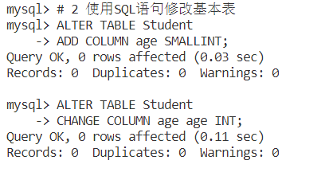

### 使用SQL语句插入数据

首先编写数据生成的Python[脚本](https://github.com/youngstudent2/sqlex/blob/master/ex1/generateData.py)

生成数据后通过`INSERT`语句插入数据

**插入学生数据**

```mysql
INSERT INTO Student
VALUES
(0,'米卡泰','社科','社科',20),
(1,'李电勇','人工智能','人工智能',20),
(2,'路世','社科','社科',20),
(3,'武琰','数理','数学',20),
(4,'晏楠','CS','软件工程',20),
(5,'滕枝','人工智能','人工智能',20),
(6,'终力','商院','经济学',20),
(7,'何忠雅','工程管理','工业工程',20),
(8,'弘姬','数理','数学',20),
(9,'衡友莉','CS','计算机应用',20),
(10,'姜加枝','商院','管理学',20),
(11,'衡友群','人工智能','人工智能',20),
(12,'芮宏','商院','保险学',20),
(13,'督子智仪','社科','社科',20),
(14,'劳婉','工程管理','工业工程',20),
(15,'隗都瑞','数理','数学',20),
(16,'庄宁','商院','保险学',20),
(17,'凤莎','商院','管理学',20),
(18,'孙无融','CS','软件工程',20),
(19,'焦妍','工程管理','工业工程',20),
(20,'米莎','社科','社科',20),
(21,'屈孝霄','CS','软件工程',20),
(22,'尚裕','社科','社科',20),
(23,'干忠辉','商院','经济学',20),
(24,'干桂','数理','物理',20),
(25,'庞伯','CS','软件工程',20),
(26,'姚被昌','工程管理','金融工程',20),
(27,'刁娴','数理','天文',20),
(28,'都电宁','商院','管理学',20),
(29,'蒋明','数理','物理',20);
```


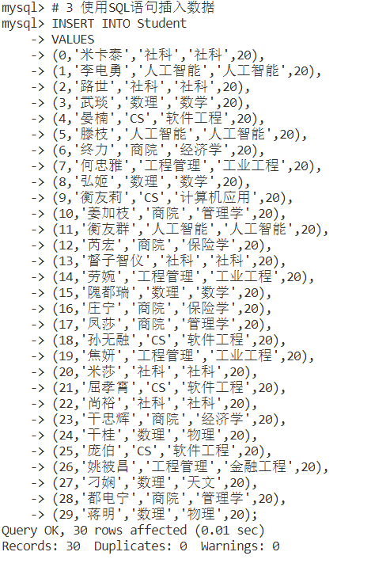

**插入课程数据**

```mysql
INSERT INTO Course
VALUES
(0,'数据库','工程管理',4),
(1,'数据库','CS',2),
(2,'数据库','人工智能',2),
(3,'操作系统','工程管理',3),
(4,'操作系统','CS',4),
(5,'操作系统','人工智能',3),
(6,'数字电路','工程管理',4),
(7,'数字电路','CS',2),
(8,'数字电路','人工智能',3),
(9,'线代','工程管理',5),
(10,'线代','CS',5),
(11,'线代','人工智能',2),
(12,'微积分','工程管理',1),
(13,'微积分','CS',5),
(14,'微积分','人工智能',4);
```


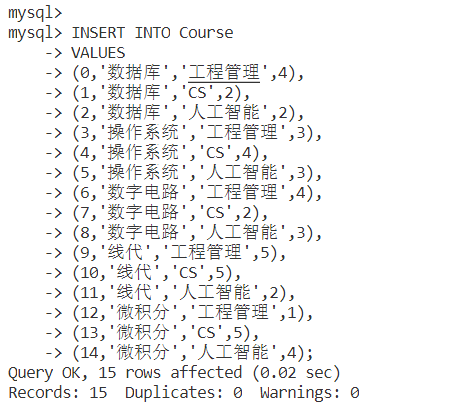

**插入选课数据**

```mysql
INSERT INTO SC
VALUES
(0,6,2020,87),
(0,7,2019,94),
(0,8,2018,90),
(1,7,2020,91),
(1,10,2020,81),
(1,14,2018,90),
(2,8,2020,99),
(2,10,2018,92),
(3,2,2019,79),
(3,6,2017,80),
(3,7,2018,99),
(3,9,2017,74),
(4,9,2018,79),
(5,8,2019,80),
(6,4,2017,82),
(6,6,2019,71),
(6,8,2018,83),
(6,9,2017,84),
(7,10,2018,95),
(7,12,2018,94),
(7,13,2017,90),
(8,10,2017,90),
(9,1,2020,89),
(9,9,2018,75),
(10,4,2020,93),
(10,6,2017,95),
(11,13,2019,86),
(12,0,2019,76),
(12,3,2018,73),
(13,1,2018,88),
(13,2,2019,86),
(13,3,2019,80),
(13,11,2017,72),
(14,2,2019,98),
(14,4,2018,73),
(14,8,2019,88),
(14,11,2020,79),
(16,9,2017,73),
(16,11,2019,90),
(17,3,2018,84),
(17,6,2018,96),
(17,11,2019,91),
(18,1,2019,82),
(18,5,2019,70),
(19,0,2017,86),
(20,0,2018,100),
(20,9,2018,81),
(21,1,2017,70),
(22,1,2019,91),
(22,2,2017,96),
(22,9,2019,100),
(24,1,2018,98),
(24,5,2020,97),
(24,11,2019,74),
(25,6,2018,100),
(27,8,2020,87),
(27,11,2019,93),
(28,4,2017,87),
(28,5,2019,98),
(29,2,2018,96),
(29,14,2018,70);
```


**插入老师数据**

```mysql
INSERT INTO Teacher
VALUES
(0,'胡伟','CS',261522),
(1,'胡伟大','人工智能',849588),
(2,'王胜利','CS',675038),
(3,'李其芳','人工智能',894765),
(4,'王曦','工程管理',146217),
(5,'张帅','工程管理',525091);
```


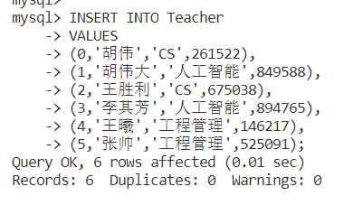

### 查询

**4.1 找出所有至少选修了一门计算机系课程的学生姓名，保证结果中没有重复的姓名**

```mysql
SELECT DISTINCT Student.name 
FROM Student,SC,Course
WHERE Student.id = SC.student_id AND SC.course_id = Course.id AND Course.dept_name = 'CS';
```

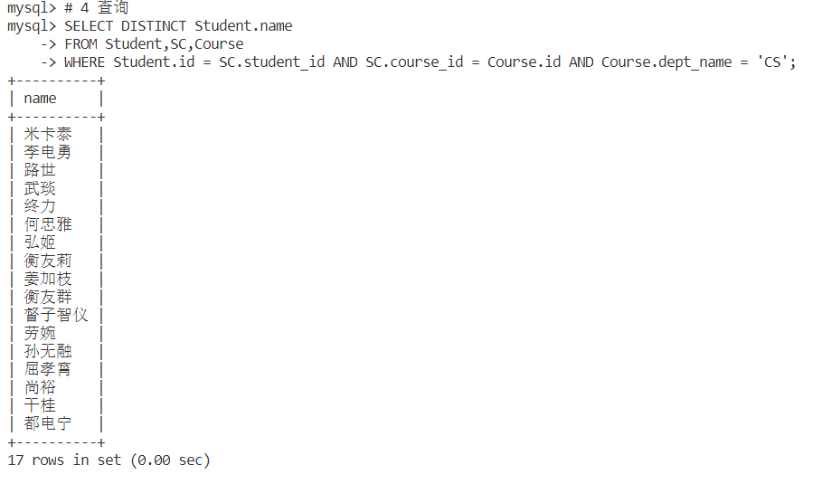


**4.2找出所有姓胡的教师的姓名和院系**

```mysql
SELECT name,dept_name
FROM Teacher
WHERE Teacher.name LIKE '胡%';
```

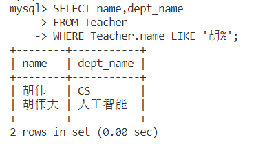

**4.3找出所有没有选修在2018年之前（不含2018年）开设的任何课程的学生的ID和姓名**

```mysql
SELECT DISTINCT id,name
FROM Student
WHERE id NOT IN (
  SELECT student_id FROM SC
  WHERE year >= 2018
);
```


**4.4找出每个系教师的最高工资值。可以假设每个系至少有一位教师**

```mysql
SELECT dept_name,max(salary) FROM Teacher
GROUP BY dept_name;
```

.png)

**4.5找出被所有学生选修过的课程**

```mysql
SELECT * FROM Course
WHERE id in (
  SELECT course_id FROM SC
  GROUP BY course_id
  HAVING COUNT(*) = (SELECT COUNT(*) FROM Course)
);
```

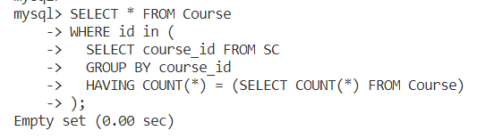


### 修改数据

```mysql
UPDATE SC
SET grade = grade + 2
WHERE course_id IN (
  SELECT id FROM Course
  WHERE title = "数据库"
);
```

**修改前**

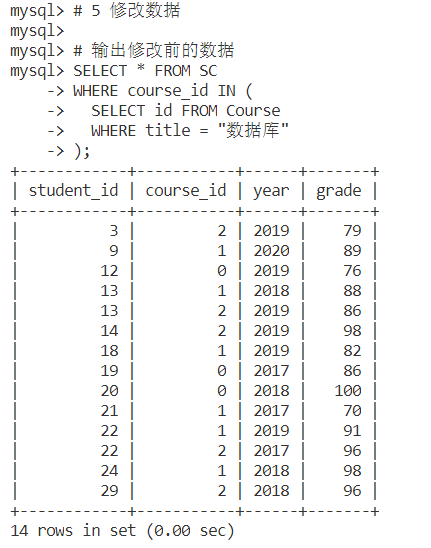

**修改**


**修改后**

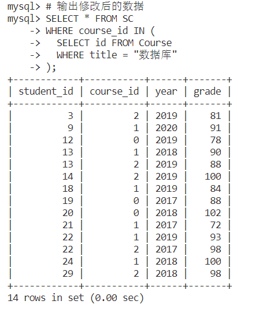

### 删除数据

```mysql
DELETE FROM SC
WHERE student_id IN (
  SELECT tmp.student_id FROM (
    SELECT student_id FROM SC 
    GROUP BY student_id
    HAVING AVG(grade) < 80
  ) AS tmp 
);
```

**删除前**

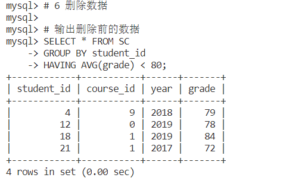

**删除**

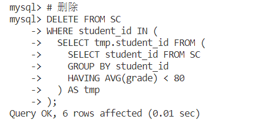

**删除后**

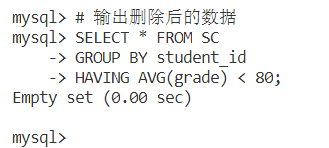

### 视图操作

```mysql
# 创建视图
CREATE VIEW myview(id,name,course_id,credit)
AS SELECT SC.student_id,Student.name,SC.course_id,Course.credit
FROM SC,Course,Student
WHERE SC.course_id = Course.id AND Student.id = SC.student_id;
CREATE VIEW TotalCredit(id,name,total_credit)
AS SELECT id,name,SUM(credit)
FROM myview
GROUP BY id;
# 输出视图
SELECT * FROM TotalCredit;
```


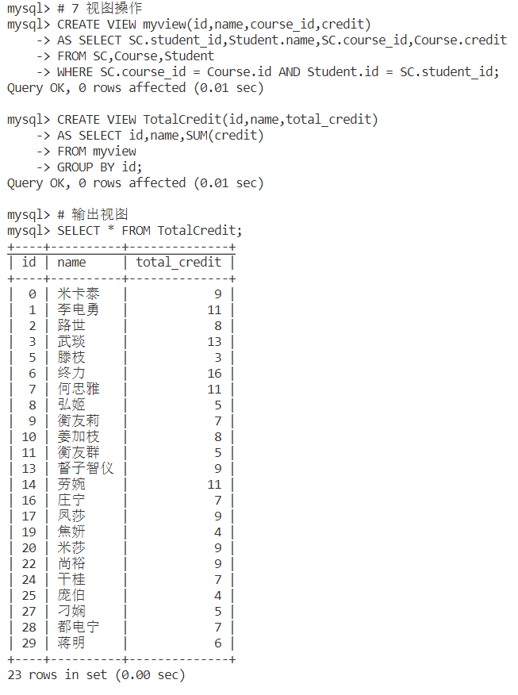

### 删除基本表

> 题目只要求删除SC表，但是为了脚本运行的方便，这里全删完了

```mysql
DROP TABLE SC;
DROP TABLE Course;
DROP TABLE Teacher;
DROP TABLE Student;
DROP VIEW myview;
DROP VIEW TotalCredit;
```

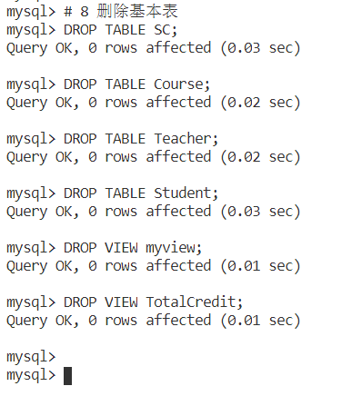

## 实验中遇到的麻烦及解决方法

**1、本次实验要生成符合要求的学生数据、课程数据、选课数据和教室数据较为麻烦**

我通过编写Python代码自动生成需要的数据，其中随机生成姓名的部分直接调用了[网上的代码](https://blog.csdn.net/qq_41426326/article/details/91975774)

**2、SQL语句在命令行中编写没有自动补全**

这对代码编写体验来说十分糟糕，但是我发现vscode创建sql后缀的文件可以完美解决这一问题。并且通过vscode的mysql插件，还可以得到图形化的数据库界面，大大提升了完成实验的效率

## 致谢

1、[mysql的语句使用教程](https://www.yiibai.com/mysql/basic-mysql.html)

2、[python生成随机姓名](https://blog.csdn.net/qq_41426326/article/details/91975774)

